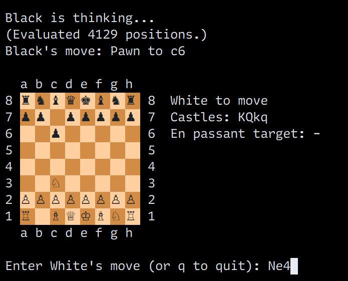

# Chest

Chest is a simple command-line chess program written in C.

## Build

`gcc` and `make` are required. No external libraries are used.

Run `make` to build the program. Two executables will result:
* `chest`, the main program
* `test`, a set of self-tests

## Play

Chest accepts moves in [algebraic
notation](https://en.wikipedia.org/wiki/Algebraic_notation_(chess)). For
example:

* To push a pawn to d4, type `d4` and hit Enter.
* To move a knight to f3, type `Nf3` and hit Enter.
* To perform a king-side castle, type either `o-o` or `Kg1` and hit Enter.

You can also do the following:
* To quit, type `q` and hit Enter.
* To print the current board state in Forsyth-Edwards Notation (FEN), type `fen` and hit Enter.

## TODO

### Correctness and Performance
* Try other ways to make move generation and evaluation quicker (e.g., bitboards.)
* Implement threefold repetition and the fifty-move rule for detecting draws.
* Add the missing fields to the `printFEN` function.

### AI
* Add iterative deepening within a time constraint.

### Interface
* Allow the Chest AI to communicate via UCI.
* Determine the Chest AI's Elo rating.

## Notes

* The overall algorithm here was inspired most directly from Sebastian Lague's
  ["Coding Adventure: Chess"](https://www.youtube.com/watch?v=U4ogK0MIzqk)
  video.
* Additional useful information came from the [Chess Programming
  wiki](https://www.chessprogramming.org/).
